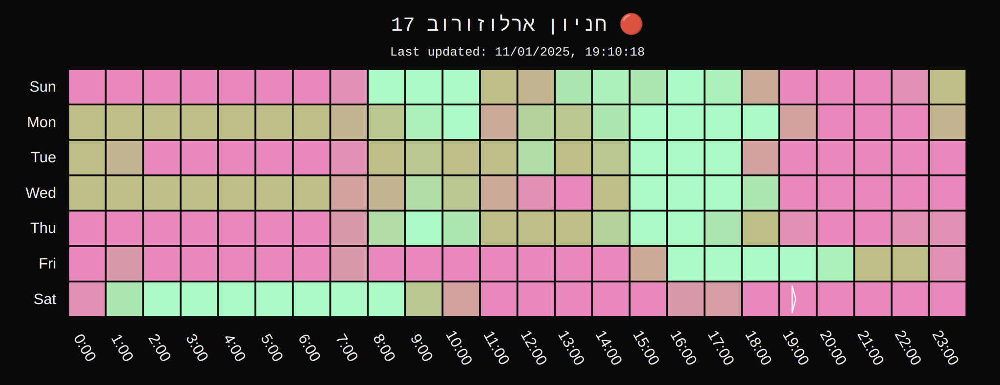

This is a [Next.js](https://nextjs.org) project bootstrapped with 
[`create-next-app`](https://nextjs.org/docs/app/api-reference/cli/create-next-app).

# Parking History Visualization

A web application that tracks and visualizes parking lot availability patterns over time. The system continuously monitors Ahuzot Hof (אחוזות חוף) parking lots and generates interactive heatmaps showing historical occupancy patterns by day and hour.



## Features

- **Monitoring**: Tracks parking lot status (occupied/has space) every 10 minutes
- **Interactive Heatmaps**: Visualize parking patterns by day and hour
- **Current Status**: Shows last updated parking lot availability
- **Historical Analysis**: View historical occupancy patterns
- **Multiple Lots**: Support for monitoring multiple parking locations (though only one is currently used)

## Architecture

The application consists of two main components:

1. **Data Collection**
   - AWS Lambda function runs every 10 minutes
   - Scrapes parking lot status from official websites
   - Stores data in DynamoDB

2. **Web Interface**
   - Next.js web application
   - Interactive D3.js visualizations for historical data
   - Periodic status updates

## Getting Started

1. Install dependencies:
```bash
npm install
```

2. Set up environment variables:
```bash
# AWS Configuration
AWS_REGION=your-region
AWS_ACCESS_KEY_ID=your-access-key
AWS_SECRET_ACCESS_KEY=your-secret-key
DYNAMODB_TABLE=your-table-name

# API Configuration
CUSTOM_CRON_SECRET=your-secret-key
```

3. Run the development server:
```bash
npm run dev
```

Open [http://localhost:3000](http://localhost:3000) to view the application.

## Lambda Function Deployment

See [lambda/README.md](lambda/README.md) for instructions on deploying the data collection function.

## License

GPLv3
